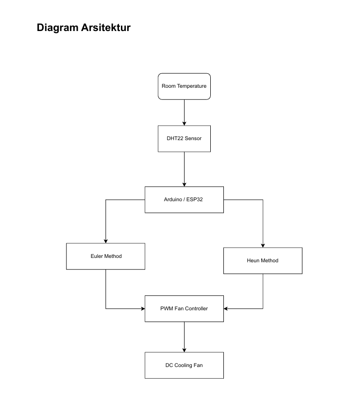
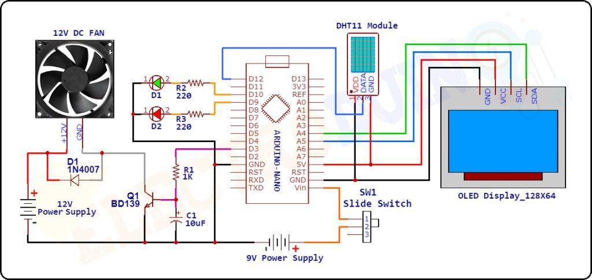
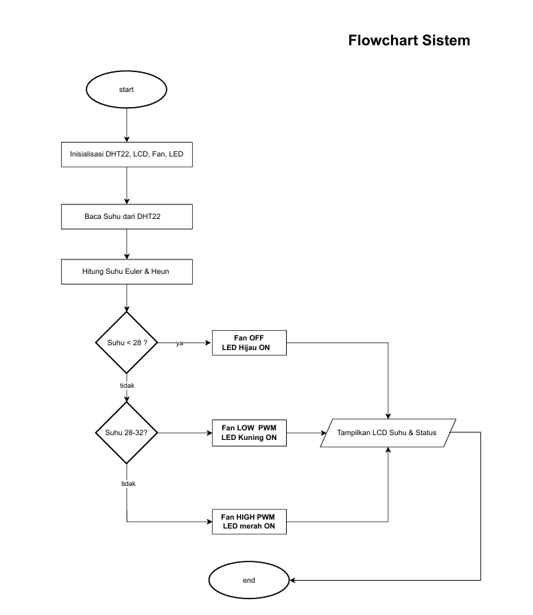
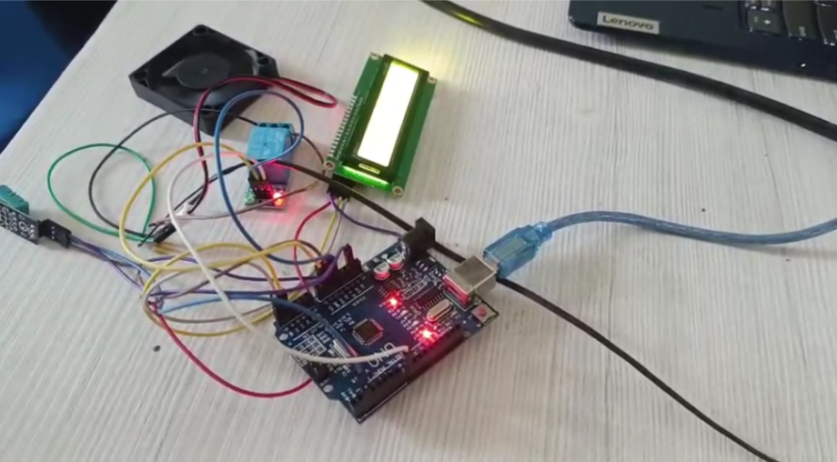

# Smart Home IoT - Auto Fan Cooling System

## Overview

Auto Fan Cooling System adalah sistem pendingin ruangan otomatis berbasis Arduino Uno yang dirancang untuk mengendalikan kipas secara otomatis berdasarkan suhu lingkungan. Sistem memanfaatkan sensor DHT11 untuk membaca suhu ruangan, relay sebagai aktuator pengendali kipas, dan LCD I2C untuk menampilkan informasi suhu secara real-time.

Selain implementasi perangkat keras, proyek ini juga melakukan analisis numerik menggunakan Metode Euler dan Metode Heun berdasarkan Hukum Pendinginan Newton untuk memodelkan perubahan temperatur terhadap waktu.

---

## Project Information

**Judul Penelitian**

Implementasi Auto Fan Cooling System Berbasis Arduino Uno Menggunakan Metode Euler dan Heun

**Program Studi**

Teknik Informatika

**Universitas**

Universitas Teknologi Bandung

### Tim Pengembang

* Dika Pida Ismail - 25552011148
* Intan Nurjamilah - 25552011140
* Muhammad Rizkia Ali Yusron - 25552011128
* Muhammad Rafly Al Bukhari - 25552011115
* Ryan Saleh Habibi - 25552011198

---

## Features

* Monitoring suhu ruangan secara real-time
* Tampilan suhu menggunakan LCD I2C
* Aktivasi kipas otomatis pada suhu ≥ 30°C
* Pengendalian kipas menggunakan relay
* Implementasi sensor DHT11
* Simulasi Hukum Pendinginan Newton
* Perbandingan Metode Euler dan Metode Heun

---

## Hardware Components

| Komponen         | Jumlah     |
| ---------------- | ---------- |
| Arduino Uno      | 1          |
| Sensor DHT11     | 1          |
| LCD I2C 16x2     | 1          |
| Relay 1 Channel  | 1          |
| Kipas DC 12V     | 1          |
| Breadboard       | 1          |
| Jumper Wire      | Secukupnya |
| Power Supply 12V | 1          |

---

## System Architecture



---

## Wiring Diagram



---

## System Flowchart



---

## Prototype



---

## Working Principle

1. Sistem melakukan inisialisasi perangkat.
2. Sensor DHT11 membaca suhu lingkungan.
3. Nilai suhu ditampilkan pada LCD I2C.
4. Arduino membandingkan suhu dengan ambang batas 30°C.
5. Jika suhu ≥ 30°C:

   * Relay aktif
   * Kipas menyala
6. Jika suhu < 30°C:

   * Relay nonaktif
   * Kipas mati
7. Proses berlangsung secara terus menerus.

---

## Source Code

Lokasi source code:

```text
src/main.ino
```

Library yang digunakan:

```cpp
Wire.h
LiquidCrystal_I2C.h
DHT.h
```

---

## Mathematical Model

### Newton's Law of Cooling

[
\frac{dT}{dt} = -k(T - T_{env})
]

Dimana:

* T = suhu ruangan
* Tenv = suhu lingkungan
* k = konstanta pendinginan
* t = waktu

---

## Euler Method

[
T_{n+1}=T_n+h f(t_n,T_n)
]

Metode Euler menggunakan gradien pada titik saat ini untuk memperkirakan nilai suhu pada langkah berikutnya.

---

## Heun Method

[
T_{n+1}=T_n+\frac{h}{2}(k_1+k_2)
]

dengan:

[
k_1=f(t_n,T_n)
]

[
k_2=f(t_n+h,T_n+h k_1)
]

Metode Heun menggunakan pendekatan predictor-corrector sehingga menghasilkan akurasi yang lebih baik dibandingkan Euler.

---

## Experimental Results

### Auto Fan Testing

| Temperature (°C) | Relay | Fan |
| ---------------- | ----- | --- |
| 28               | OFF   | OFF |
| 29               | OFF   | OFF |
| 30               | ON    | ON  |
| 31               | ON    | ON  |
| 32               | ON    | ON  |

### Observation

* Sistem berhasil mengaktifkan kipas pada suhu 30°C.
* Sistem berhasil mematikan kipas pada suhu di bawah 30°C.
* Sensor DHT11 mampu membaca suhu secara real-time.
* Relay bekerja sesuai logika yang dirancang.

---

## Numerical Simulation Result

Hasil simulasi menunjukkan bahwa:

* Metode Euler mampu memodelkan perubahan temperatur.
* Metode Heun menghasilkan error yang lebih kecil.
* Metode Heun memberikan pendekatan yang lebih dekat terhadap solusi teoritis.

---

## Project Structure

```text
auto-cooling-fan-system/
│
├── src/
│   └── main.ino
│
├── docs/
│   ├── wiring-diagram.png
│   └── flowchart.png
│
├── images/
│   └── prototype.jpg
│
└── README.md
```

---

## Future Improvements

* Menggunakan sensor DHT22 untuk akurasi yang lebih tinggi.
* Implementasi IoT menggunakan ESP8266 atau ESP32.
* Monitoring suhu melalui web dashboard.
* Kontrol kipas bertingkat menggunakan PWM.
* Penyimpanan data ke cloud database.

---

## Conclusion

Auto Fan Cooling System berhasil diimplementasikan menggunakan Arduino Uno dan sensor DHT11. Sistem mampu mengendalikan kipas secara otomatis berdasarkan suhu lingkungan dengan ambang aktivasi 30°C. Analisis numerik menunjukkan bahwa Metode Heun memberikan hasil yang lebih akurat dibandingkan Metode Euler dalam memodelkan proses pendinginan berdasarkan Hukum Pendinginan Newton.

---

## References

1. Chapra, S. C., & Canale, R. P. Numerical Methods for Engineers (7th Edition).
2. Burden, R. L., & Faires, J. D. Numerical Analysis.
3. Kadir, A. Arduino dan Sensor.
4. Ogata, K. Modern Control Engineering.
5. Incropera, F. P. Fundamentals of Heat and Mass Transfer.

---

## License

This project is developed for academic and educational purposes.
© 2026 Universitas Teknologi Bandung
